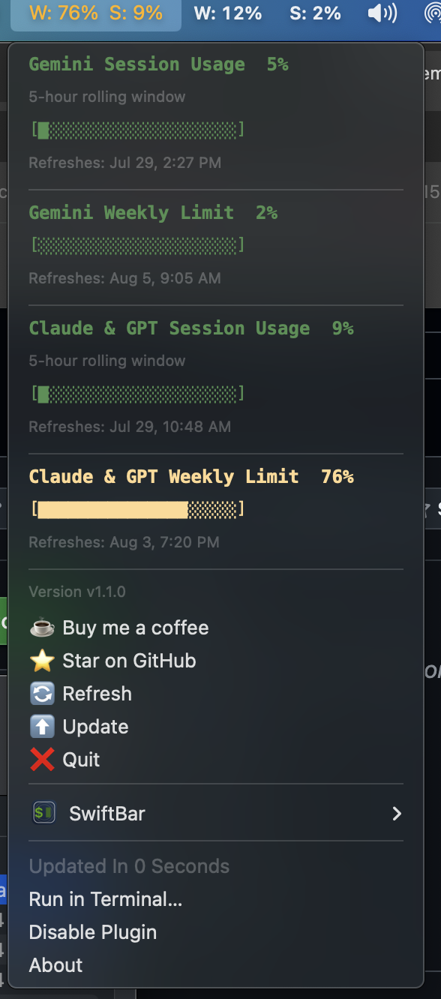
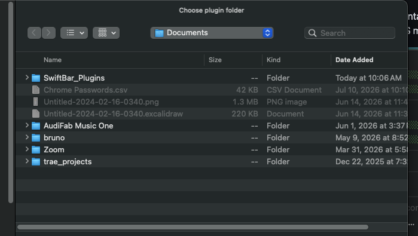
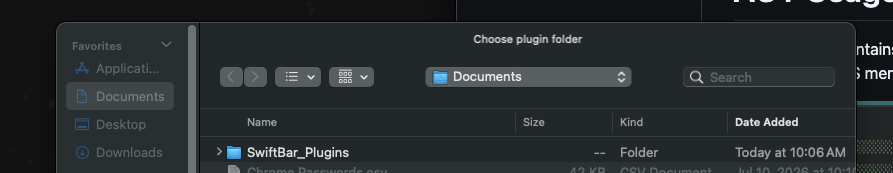

# AGY Usage Tracker

This directory contains a lightweight SwiftBar widget that allows you to monitor your Antigravity (agy) usage directly from your macOS menu bar.



## Features
- **Auto-Refresh**: The widget automatically updates your usage stats every 30 seconds.
- **Menu Bar View**: Shows your overall model usage (e.g., `W: 76% S: 9%`).
- **Dropdown Details**: Displays comprehensive usage bars, percentages, and exact 12-hour refresh times for both **GEMINI** and **CLAUDE & GPT**.
- **Manual Refresh**: Click `Refresh` in the dropdown to instantly fetch your latest usage data.

## Changelog

### v1.1.0
- 🚀 **Claude & GPT Support**: Added full support for tracking Claude & GPT model limits (Session & Weekly) alongside Gemini.
- 🕒 **12-Hour Refresh Clock Times**: Converted relative reset durations to exact local 12-hour timestamps (e.g., `Jul 29, 2:27 PM`).
- 🐛 **Section-Isolated Parsing Bug Fix**: Fixed a regex cross-section bug where unused model limits would pull reset timers from other model groups.
- 🎨 **UI Alignment**: Adjusted header spacing between section titles and percentage indicators.

## Prerequisites
- **agy must be installed and already logged in** via the terminal (`agy login`).

## Installation

```bash
brew tap shempaiii/agy-usage-tracker
brew trust shempaiii/agy-usage-tracker
brew install agy-usage-tracker
```

## Start from CLI

If the widget isn't running or you need to start it from the terminal, simply run:

```bash
open -a SwiftBar
```

## How it Works
Since `agy` requires a pseudo-terminal (TTY) to properly output formatted usage data without ANSI artifacts, the widget uses `tmux` in the background to launch `agy limits`, capture the output, and parse it in Python for SwiftBar.

## FAQ

**1. How do I make SwiftBar start automatically when I log in?**
Open the SwiftBar menu, click on **SwiftBar** at the bottom, select **Preferences**, and check **Launch at login**. This ensures the widget is always running in your menu bar.

**2. I received a popup asking to "Choose plugin folder" when starting SwiftBar. What do I select?**
This is a standard macOS security requirement. When the "Choose plugin folder" window appears, simply navigate to your `Documents` folder, select the `SwiftBar_Plugins` folder, and click **Open**. This grants SwiftBar permission to read the widget files.


<br>


**3. How do I uninstall the widget?**
To completely remove the widget, run `brew uninstall agy-usage-tracker` in your terminal. The widget will automatically detect the uninstallation and remove itself from your menu bar.

## Privacy
**No Tracking:** This tool operates entirely locally on your machine. It does not track, store, or send any of your usage data or personal information anywhere.

## Acknowledgments
This widget was heavily inspired by the native [Claude-Usage-Tracker](https://github.com/hamed-elfayome/Claude-Usage-Tracker) macOS app by Hamed Elfayome.

## Support

⭐ **Star this project!** If this widget has been helpful to you, leaving a star on the repository would mean the world to me and helps others discover it.

☕ **Support my work:** I build these tools in my free time, and I truly appreciate any support I receive! If you'd like to say thanks, a coffee is always incredibly appreciated.

<br>

